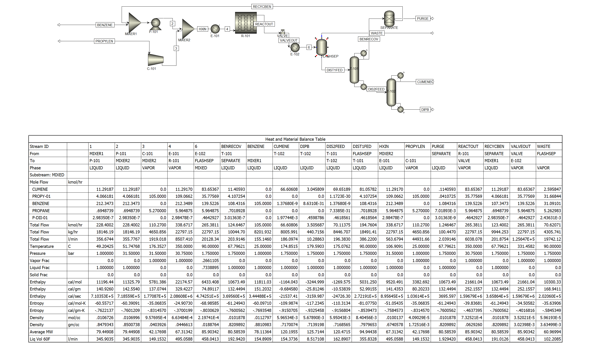

**Level1**

**PFD**

**Level2**

**EQUIPMENT SUMMARY**

HEAT EXCHANGERS

E-101 - hps

Area: 20.8 m2 total

Temperature: 350 °C

Pressure: 30.75 bar

U: 600 W/m2°C (desubcooling zone), 1500 W/m2°C (vaporizing)

E-102 - cw

Area: 533 m2

Temperature: 90 °C

Pressure: 1.75 bar

Duty: 16,400 MJ/h

PUMPS/COMPRESSORS

P-101

Type: centrifugal

Pressure increase: 30.5 bar

Driver rating: 21.9 kW

C-101

Type: Isentropic

Pressure increase: 30.5 bar

REACTORS

R-101

Height: 6 m

Diameter: 3 in

Volume: 6.50 m3

Temperature: 350 °C

Number of tubes: 234

Orientation: Horizontal

U: 65 W/m2°C 

Duty: 9840 MJ/h

TOWERS

T-101 (distillation tower)

Diameter: 1.13 m

Pressure: 1.75 bar

Number of trays: 27

Number of stages:29

Orientation: Vertical

Duty: 5390 MJ/h (condenser), 7100 MJ/h (reboiler)

T-102 (distillation tower)

Diameter: 1.26

Pressure: 1.75 bar

Number of trays: 37

Number of stages: 39

Orientation: Vertical

Duty: -5490 MJ/h (condenser), 5520 MJ/h (reboiler)

VESSELS

V-101 (flash separator)

Height: 5.2 m

Diameter: 1 m

V-102 (separator)

Height: 3.2 m

Diameter: 1 m

